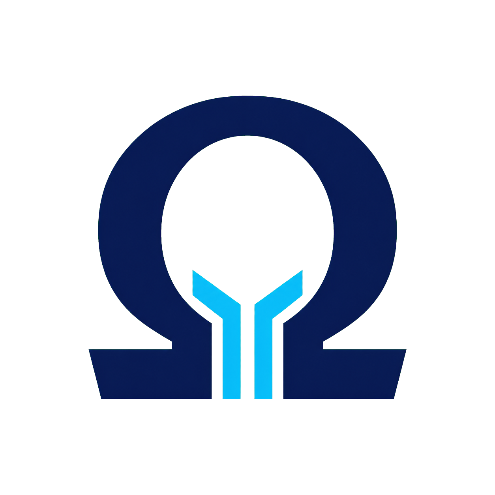

# Omega Kernel

<p align="center">
  
</p>

<p align="center">A cross-architecture operating-system kernel for x86_64, AArch64, and RISC-V 64.</p>

## Overview

**Omega** is a lightweight, high-performance operating-system kernel with an explicit ABI boundary, native userspace entry paths, and a QEMU-based verification workflow. It cross-compiles using Clang and LLVM (`ld.lld`) for **x86_64** (x64), **AArch64** (ARM64), and **RISC-V 64 (`rv64gc`)**.

---

## Contents

- [Overview](#overview)
- [Key Features](#key-features)
- [Technical Implementation](#technical-implementation)
- [Documentation](#documentation)
- [Repository Structure](#repository-structure)
- [Building and Running](#building-and-running)
- [Automated Tests](#automated-tests)
- [License](#license)

## Key Features

### Kernel and architecture support

- **Clang/LLVM Cross-Compilation**: Built using `clang++`, `ld.lld`, and CMake toolchain integration without external GCC cross-compiler dependencies.
- **Triple Architecture Support**:
  - **x86_64 (x64)**: 64-bit Long Mode entry, PAE paging, PML4 4-level page tables (2MB Huge Pages identity mapping), GDT loading, Xen PVH ELF note (`.xen_note`) for direct QEMU booting, and **Standard VGA** output (VGA text mode + Bochs VBE linear framebuffer).
  - **AArch64 (ARM64)**: Dynamic Exception Level transition (`EL2 -> EL1`), 2048-byte aligned `VBAR_EL1` vector table, and `SP_EL1` stack setup.
  - **RISC-V 64 (`rv64gc`)**: Supervisor Mode (S-mode) boot entry, `Sv39` 3-level page tables, `stvec` trap vector, OpenSBI console `ecall` interface, `satp` register mapping, and validated OpenSBI-to-`kernel_main()` handoff.
- **Omega Kernel Runtime**: Independent of host C/C++ standard libraries while preserving the documented Omega ABI. Implements Omega's memory primitives (`memcpy`, `memset`, `memmove`, `memcmp`) and vararg printing (`kprintf`).
- **Physical Memory Manager (PMM)**: 4KiB Bitmap Frame Allocator tracking physical page frames (`alloc_frame` / `free_frame`).
- **Virtual Memory Manager (VMM)**: Architectural bring-up page-table support through `CR3` on x86_64, `TTBR0_EL1` on AArch64, and `satp` on RISC-V 64; x86_64 also has per-process roots, dedicated user PML4 slots, and isolated anonymous mappings.
- **Dynamic Kernel Heap Allocator**: Free-list block header allocator providing standard C ABI bindings (`kmalloc` / `kfree`) with 8-byte alignment and block coalescing.
- **Hardware Interrupt Architecture**: 256-entry Interrupt Descriptor Table (IDT) for x86_64, System Vector Base (`VBAR_EL1`) for AArch64, and Supervisor Trap Vector (`stvec`) / PLIC for RISC-V 64.
- **Preemptive Multi-threading Scheduler**: Round-robin TCB engine with x86_64 PIT preemption, real interrupt-frame context switching, cooperative yield integration, and guarded cross-architecture fallback behavior.
- **Linux-Compatible System Call ABI**: Architecture-specific Linux syscall numbering for x86_64, AArch64, and RISC-V 64, six-argument dispatch, Linux-style negative errno returns, and native x86_64 `syscall`/`sysretq`, AArch64 `svc`/`eret`, and RISC-V `ecall`/`sret` entry paths. See [`docs/ABI.md`](docs/ABI.md).
- **Keyboard and HID Input Foundation**: Versioned 64-byte input events, bounded kernel queue, raw keyboard transitions, modifier flags, relative mouse motion, buttons, input syscalls, HID boot-report decoders, and x86_64 PS/2 polling with portable AArch64/RISC-V adapters.
- **Virtual Filesystem (VFS) & Initrd RAM Disk**: POSIX-like node tree with Linux-style UID/GID ownership, mode bits, umask-aware security foundations, traversal checks, and read/write permission enforcement.
- **Linux-Compatible Users, Groups & Permissions**: Real/effective/saved filesystem IDs, supplementary groups, root DAC behavior, `chmod`/`chown`, `setuid`/`setgid`, `setgroups`, `umask`, and shared permission semantics on all three ISAs.
- **Process Address Spaces**: Per-process roots with user mappings on x86_64, AArch64, and Sv39 RISC-V; permission-bearing ELF PT_LOAD mapping, retained physical frames, native init activation, and verified COW fork/fault/exit/wait-reap lifecycle on all three ISAs.
- **x86_64 Userspace Bootstrap**: Initrd-backed static `/init`, ELF `PT_LOAD` segment mapping, user stack creation, Ring 3 `iretq` entry, TSS-backed kernel stack, page-fault entry, and native `syscall`/`sysretq` return. Verify with [`scripts/test_userland.sh`](scripts/test_userland.sh).
- **Cross-Architecture Userspace Bootstrap**: AArch64 EL0 and RISC-V U-mode `/init` programs with native exception entry, syscall dispatch, fault reporting, timer setup, COW fault recovery, and `eret`/`sret` return paths. Verify with [`scripts/test_native_userland.sh`](scripts/test_native_userland.sh) and [`scripts/test_c_sdk.sh`](scripts/test_c_sdk.sh).
- **Userland Mode Manager**: Real x86_64 Ring 3, AArch64 EL0, and RISC-V U-mode entry, with lower-privilege syscall/fault vectors and architecture-specific timer setup.
- **ELF 64-bit Executable Loader**: Bounded matching-ISA validation plus static `ET_EXEC` `PT_LOAD` mapping, initial-stack construction, and least-privilege execution on all three ISAs; relocations beyond static link-time resolution and dynamic linking remain pending.
- **Linux ELF Artifact Boundary**: Validates matching-ISA ELF64 `ET_EXEC`/static `ET_DYN` program headers; static archives are link-time inputs, while dynamic `.so` execution remains gated on Omega's future dynamic linker.
- **PCI Bus Scanner**: Bus configuration space reader (`0xCF8` Address / `0xCFC` Data ports) enumerating vendor/device IDs across 256 PCI buses.
- **VirtIO Network Stack**: VirtIO-Net packet reader, Ethernet L2, IPv4 L3, and UDP/TCP L4 stack headers.
- **System Display Module (x86_64 Standard VGA)**: Layered display HAL with VGA text mode (80×25 at `0xB8000`), Bochs VBE linear framebuffer (1024×768×32 via DISPI), Multiboot2 framebuffer handoff, 8×16 bitmap font, and a kernel graphical console. `kprintf` output is mirrored to serial (COM1) and the active display backend concurrently.
- **AArch64/RISC-V Display Integration**: Shared FDT walker and validated framebuffer metadata, format-aware portable framebuffer rendering, identity-map safety bounds, serial fallback, and an opt-in VirtIO-GPU MMIO 2D bring-up path with bounded failure behavior.
- **Cross-Architecture Storage Foundation**: Common block requests, device lifecycle and driver registration, DMA mapping, GPT/MBR parsing, ext4 filesystem mounting via partition offset, writable/read-only policy, flush/barrier handling, and a synthetic block backend verified on x86_64, AArch64, and RISC-V.
- **VirtIO-Block Path**: Opt-in x86_64 transitional VirtIO-PCI discovery with legacy queue geometry, feature negotiation, and verified read/write/flush completion; AArch64/RISC-V VirtIO-MMIO remains experimental. Enable with `-DENABLE_EXPERIMENTAL_VIRTIO_BLOCK=ON`.
- **Firmware & Bootloader Compatibility**: Compatible with **UEFI/GPT**, **U-Boot** (`bootefi` / `booti`), and **Coreboot** (TianoCore / GRUB).
- **Multi-Format Virtual Disk Image Generator**: Generates GPT RAW (`.img`), QCOW2 (`.qcow2`), VMDK (`.vmdk`), and VDI (`.vdi`) images with a FAT32 EFI System Partition, ext4 root, and installed musl/TinyCC/POSIX payload; `--legacy-fat` preserves the old single-volume format.
- **Omega Virtual Device (OVD) Manager & GUI**: Android-like multi-architecture device manager with schema validation, predefined real-device profiles, ext4 artifact/digest checks, safe process lifecycle commands, daemon logs/QMP state, snapshots, import/export, networking/initrd/ephemeral profiles, selectable storage transports, a styled VirtualBox-inspired Tkinter manager, and an integrated resilient VNC viewer with keyboard, mouse, framebuffer, and clipboard support.
- **OVD Real-Device Profile Catalog**: Versioned x86_64, AArch64, and RISC-V profile definitions with deterministic validation/rendering, ext4-default native artifact policy, and explicit external-adapter classification.
- **Containerization & CI/CD**: Minimal Alpine-based `Dockerfile`, VSCode DevContainers/Codespaces (`.devcontainer/devcontainer.json`), and GitHub Actions CI/CD (`.github/workflows/ci.yml`).

### Feature status

The native `/init` path and page-granular COW fork, write-fault, exit, and wait/reap lifecycle are verified on all three reference platforms. Scheduler-driven process switching, signals, and SMP remain planned.

### Implemented subsystem groups

| Area | Current implementation |
| :--- | :--- |
| Boot and architecture | x86_64 long mode, AArch64 EL2 to EL1, RISC-V S-mode through OpenSBI |
| Memory | Bitmap PMM, dynamic heap, x86_64 page tables, AArch64 TTBR0 mappings, RISC-V Sv39 mappings |
| Userspace | Initrd-backed ELF `/init`, native Ring 3, EL0, and U-mode entry, syscall return paths on all three ISAs |
| Processes | Per-process roots, user mappings, and COW lifecycle verification on all ISAs |
| Security | Linux-style credentials, groups, ownership, mode checks, DAC rules, and umask foundations |
| Filesystems | VFS node tree and initrd RAM disk with permission-aware access checks |
| Storage | Common block API, DMA abstraction, GPT/MBR parsing, ext4 mounting, synthetic backend, experimental VirtIO-Block |
| Networking | VirtIO-Net, Ethernet, IPv4, UDP, and TCP foundations |
| Input | Versioned input ABI, keyboard and mouse events, HID boot reports, PS/2 backend, portable adapters |
| Display | x86_64 VGA and Bochs VBE, SimpleFb on AArch64 and RISC-V, serial fallback, Omega boot logo |
| Development tools | Boot image generator, OVD manager and GUI, QEMU launchers, unit and integration tests |

---

## Technical Implementation

### Bootstrapping and Architectural Handover
- **x86_64 (`kernel/arch/x86_64/boot.s`)**:
  - Entry point `_start` identity-maps initial 1 GB physical memory using 2 MB Huge Pages. Enables PAE, activates Long Mode via `EFER` MSR, loads GDT, and jumps to `kernel_main()`.
  - Includes a Xen PVH ELF Note (`.xen_note` section with `PT_NOTE` program header) to enable QEMU direct `-kernel` loading.
- **AArch64 (`kernel/arch/aarch64/boot.s` & `vectors.s`)**:
  - Configures `HCR_EL2.RW = 1` for 64-bit EL1 execution, sets up `SPSR_EL2` to target `EL1h`, executes `eret` to transition from EL2 to EL1, configures `VBAR_EL1` vector table, and enables FP/SIMD (`CPACR_EL1.FPEN = 0b11`).
- **RISC-V 64 (`kernel/arch/riscv64/boot.s` & `trap.s`)**:
  - Supervisor Mode entry loaded at `0x80200000` above OpenSBI firmware. Clears `sstatus.SIE`, initializes `stvec` supervisor trap vector, sets up 16 KiB boot stack pointer, and branches to `kernel_main()`.

### System Display Module

| Document | Architecture | Phase | Status |
| :--- | :--- | :--- | :--- |
| [`docs/VGA_DISPLAY_PLAN.md`](docs/VGA_DISPLAY_PLAN.md) | x86_64 Standard VGA | 7.2 | **Implemented** |
| [`docs/DISPLAY_AARCH64_RISCV_PLAN.md`](docs/DISPLAY_AARCH64_RISCV_PLAN.md) | AArch64 & RISC-V 64 | 7.2b | **SimpleFb integrated; guarded VirtIO-GPU foundation** |
| [`docs/STORAGE_ARCHITECTURE_PLAN.md`](docs/STORAGE_ARCHITECTURE_PLAN.md) | All architectures | 7.1+ | **Storage architecture and implementation plan** |

**x86_64 (Phase 7.2 — done):** VGA text mode, Bochs VBE linear FB, Multiboot2 handoff, dual serial+display console.

**AArch64 / RISC-V:** Shared FDT parsing, framebuffer fallback, native lower-privilege entry/traps, per-process TTBR0/Sv39 roots, ELF `/init`, and timer setup are implemented. VirtIO-GPU, SMP, and production interrupt-controller support remain planned.

**Userspace:** A freestanding static C `/init` is built for each reference ISA,
packed into the Omega initrd format, loaded into PID 1's isolated address
space, and entered in the native least-privileged mode. The init programs
perform `SYS_write` and `SYS_exit` through x86_64 `syscall`/`sysretq`, AArch64
`svc`/`eret`, and RISC-V `ecall`/`sret` paths. All three ISAs verify COW
`fork`, write-fault isolation, exit, and wait/reap. Full libc, signals,
architecture-neutral process switching, and dynamic linking remain future work.

**Storage:** The architecture and initial implementation are specified in [`docs/STORAGE_ARCHITECTURE_PLAN.md`](docs/STORAGE_ARCHITECTURE_PLAN.md). The common layer is implemented and tested; GPT/MBR parsing, ext4 mounting, synthetic writes/flushes, and guarded VirtIO-Block request paths are available. NVMe, AHCI/SATA/ATAPI, SDHCI, USB Mass Storage, and hardware-specific writes remain subsequent milestones.

| Layer | Location | Role |
| :--- | :--- | :--- |
| **HAL** | `kernel/include/arch/display.hpp`, `kernel/arch/x86_64/{display,vga_text,vga_regs,bochs_vbe,boot_fb}.cpp` | Backend selection: BootFramebuffer → BochsVbe → VgaText |
| **Architecture HALs** | `kernel/arch/{aarch64,riscv64}/display.cpp` | SimpleFb probe, identity-map bring-up, serial fallback; guarded VirtIO-GPU hook |
| **Console** | `kernel/sys/display_console.cpp`, `kernel/sys/framebuffer.cpp`, `kernel/sys/font.cpp` | Dual-target console (serial + VGA text + FB), font rendering |
| **Integration** | `kernel/init/main.cpp`, `kernel/sys/kprint.cpp`, `kernel/sys/fdt.cpp` | All architectures initialize the display HAL after PMM/VMM; `kprintf` routes through the shared console |

**QEMU launch (x86_64):**

```bash
./scripts/run_qemu.sh              # headless Bochs VBE: -vga std -display none
./scripts/run_qemu.sh --gui        # graphical window (SDL / Cocoa)
./scripts/run_qemu.sh --text       # VGA text fallback: -vga none
./scripts/run_qemu.sh --storage virtio --dry-run  # inspect x86_64 VirtIO disk wiring
./scripts/run_qemu.sh --network user --initrd build/initrd.img --dry-run
./scripts/run_qemu.sh --ephemeral --qmp
```

**x86_64 userspace init:**

```bash
./scripts/test_userland.sh         # build /init, pack initrd, boot Ring 3 under QEMU
./scripts/test_native_userland.sh  # verify AArch64 EL0 and RISC-V U-mode /init
```

The focused userspace test uses QEMU's loader device to place the generated
Omega initrd at `0x600000`, then verifies ELF mapping, Ring 3 entry, and the
userspace syscall output. The generic `run_qemu.sh --initrd FILE` option is
also available for launcher experiments.

The complete launcher and image-generation options are documented in
[`scripts/README.md`](scripts/README.md). Build and image locations can be
isolated with `OMEGA_BUILD_ROOT` and `OMEGA_IMAGE_ROOT`.

### 3. System Call ABI Conventions (`docs/ABI.md`)
- **x86_64**: `syscall` instruction (Syscall ID in `RAX`, Args in `RDI`, `RSI`, `RDX`, `R10`, `R8`, `R9`; `RCX`/`R11` are hardware-clobbered).
- **AArch64**: `svc #0` instruction (Syscall ID in `X8`, Args in `X0`-`X5`).
- **RISC-V 64**: `ecall` instruction (Syscall ID in `A7`, Args in `A0`-`A5`).

---

## Documentation

| Document | Purpose |
| :--- | :--- |
| [`docs/ARCHITECTURE.md`](docs/ARCHITECTURE.md) | Kernel architecture and subsystem boundaries |
| [`docs/ABI.md`](docs/ABI.md) | System call and userspace ABI |
| [`docs/COMMUNICATIONS_INTEGRATION_PLAN.md`](docs/COMMUNICATIONS_INTEGRATION_PLAN.md) | Communications Integration Plan |
| [`docs/COMPLETION_REPORT.md`](docs/COMPLETION_REPORT.md) | Final Verification Report |
| [`docs/FIRMWARE_BOOT.md`](docs/FIRMWARE_BOOT.md) | Firmware and bootloader compatibility |
| [`docs/OMEGA_SDK_PLAN.md`](docs/OMEGA_SDK_PLAN.md) | Future lightweight userspace SDK |
| [`docs/OVD_REAL_DEVICE_PROFILE_PLAN.md`](docs/OVD_REAL_DEVICE_PROFILE_PLAN.md) | OVD profile registry and artifact plan |
| [`docs/POINTING_DEVICES_INTEGRATION_PLAN.md`](docs/POINTING_DEVICES_INTEGRATION_PLAN.md) | Pointing Devices Integration Plan |
| [`docs/REAL_HARDWARE_VALIDATION_MATRIX.md`](docs/REAL_HARDWARE_VALIDATION_MATRIX.md) | Real Hardware Validation Matrix |
| [`docs/RISCV64_PLAN.md`](docs/RISCV64_PLAN.md) | RISC-V 64 Architectural Plan |
| [`docs/ROADMAP.md`](docs/ROADMAP.md) | Current milestones and remaining work |
| [`docs/RUNNING.md`](docs/RUNNING.md) | Build and QEMU execution guide |
| [`docs/STORAGE_ARCHITECTURE_PLAN.md`](docs/STORAGE_ARCHITECTURE_PLAN.md) | Storage architecture and driver roadmap |
| [`docs/SUMMARY.md`](docs/SUMMARY.md) | Project Summary |
| [`docs/VGA_DISPLAY_PLAN.md`](docs/VGA_DISPLAY_PLAN.md) | x86_64 display implementation |
| [`docs/DISPLAY_AARCH64_RISCV_PLAN.md`](docs/DISPLAY_AARCH64_RISCV_PLAN.md) | AArch64 and RISC-V display implementation |
| [`scripts/README.md`](scripts/README.md) | Script catalog and verification workflow |

---

## Repository Structure

```text
omega/
├── Dockerfile                     # Minimal Alpine-based cross-compilation environment
├── .devcontainer/                 # VSCode DevContainers and GitHub Codespaces configuration
├── .github/workflows/ci.yml       # GitHub Actions Multi-Arch CI/CD Pipeline
├── CMakeLists.txt                 # Master CMake cross-compilation target script
├── assets/branding/
│   ├── omega-logo-hd.png          # HD flat-color Omega PNG logo
│   └── omega-logo-flat.svg        # Scalable flat-color Omega SVG logo
├── cmake/
│   ├── x86_64-toolchain.cmake     # x86_64 toolchain configuration
│   ├── aarch64-toolchain.cmake    # AArch64 toolchain configuration
│   └── riscv64-toolchain.cmake    # RISC-V 64 toolchain configuration
├── disk_images/                   # Multi-format virtual disk images (RAW, QCOW2, VMDK, VDI)
├── docs/
│   ├── ARCHITECTURE.md            # Architectural Specification
│   ├── ABI.md                     # System Call ABI Specification
│   ├── COMMUNICATIONS_INTEGRATION_PLAN.md # Communications Integration Plan
│   ├── COMPLETION_REPORT.md       # Final Verification Report
│   ├── DISPLAY_AARCH64_RISCV_PLAN.md  # SDM — AArch64/RISC-V extension (Phase 7.2b)
│   ├── FIRMWARE_BOOT.md           # U-Boot & Coreboot Firmware Compatibility
│   ├── OMEGA_SDK_PLAN.md          # Lightweight C/C++ SDK and Linux artifact ABI plan
│   ├── OVD_REAL_DEVICE_PROFILE_PLAN.md # OVD profile registry and artifact plan
│   ├── POINTING_DEVICES_INTEGRATION_PLAN.md # Pointing Devices Integration Plan
│   ├── REAL_HARDWARE_VALIDATION_MATRIX.md # Real Hardware Validation Matrix
│   ├── RISCV64_PLAN.md            # RISC-V 64 Architectural Plan
│   ├── ROADMAP.md                 # Multi-Phase Implementation Roadmap
│   ├── RUNNING.md                 # QEMU Execution & Build Guide
│   ├── STORAGE_ARCHITECTURE_PLAN.md   # Cross-architecture storage architecture
│   ├── SUMMARY.md                 # Project Summary
│   └── VGA_DISPLAY_PLAN.md        # SDM — x86_64 Standard VGA (Phase 7.2)
├── emulator/
│   ├── README.md                  # OVD manager, profiles, GUI, and tests
│   ├── profiles/                  # Canonical predefined OVD profile catalog
│   ├── ovd/                       # OVD Subdirectory
│   ├── profile_catalog.py         # Profile validation, rendering, artifacts
│   ├── ovd_core.py                # Cross-platform manager, profiles, lifecycle, QEMU backend
│   ├── ovd_cli.py                 # Python CLI
│   ├── ovd_manager.py             # Python manager entry point
│   ├── ovd_run.py                 # Python launcher entry point
│   ├── ovd_gui.py                 # Built-in tkinter GUI
│   ├── ovd_vnc.py                 # Built-in Tkinter VNC viewer
│   ├── test_ovd_unit.py           # Python OVD manager unit tests
│   ├── test_profile_catalog.py    # Python profile tests
│   ├── test_profile_ext4_integration.py # Python ext4 profile policy tests
│   └── test_vnc.py                # VNC tests
├── scripts/
│   ├── README.md                  # Script catalog, usage, and verification guide
│   ├── create_bootable_disk.sh    # Configurable multi-arch boot image generator
│   ├── run_qemu.sh                # x86_64 launcher with storage/network/initrd options
│   ├── test.sh                    # Non-destructive multi-arch regression suite
│   ├── test_display.sh            # VGA / System Display Module test matrix
│   ├── test_display_aarch64.sh    # AArch64 display HAL/fallback smoke test
│   ├── test_display_riscv64.sh    # RISC-V display HAL/fallback smoke test
│   ├── test_display_gpu.sh         # Experimental VirtIO-GPU safe-probe test
│   ├── test_display_unit.sh         # Framebuffer format/bounds unit test
│   ├── test_boot_framebuffer_unit.sh # Multiboot framebuffer parser unit test
│   ├── test_storage_unit.sh       # Host storage API/partition unit tests
│   ├── test_input_unit.sh         # Input ABI and decoder unit tests
│   ├── test_storage.sh            # Storage unit + all-ISA QEMU integration tests
│   ├── test_process.sh            # x86_64 process mapping isolation test
│   ├── test_security.sh           # Linux credentials and VFS permission tests
│   ├── test_scheduler.sh          # x86_64 timer/context-switch test
│   ├── test_elf_loader.sh         # Linux ELF64 artifact validation test
│   ├── build_user_init.sh          # Build the architecture-specific userspace /init
│   ├── create_initrd.py            # Pack userspace artifacts into an Omega initrd
│   ├── test_userland.sh            # x86_64 ELF/Ring 3/syscall integration test
│   ├── test_native_userland.sh     # AArch64 EL0 and RISC-V U-mode integration test
│   ├── test_c_sdk.sh               # Static C SDK application on all reference ISAs
│   ├── sdk_manifest.py             # SDK artifact manifest creation/validation
│   ├── test_sdk_manifest.sh        # SDK manifest integrity test
│   ├── test_scripts_unit.py       # Python launcher and emulator unit-test entry point
│   └── test_disk_images.sh        # Disk Image Verification Test Suite
├── tests/                         # C++ unit tests for kernel components
├── kernel/
    ├── arch/
    │   ├── x86_64/                # Boot, serial, idt, pci, VGA/display, linker.ld
    │   ├── aarch64/               # Boot, vectors, uart, gic, pci, SimpleFb display, linker.ld
    │   └── riscv64/               # Boot, trap, uart, plic, pci, SimpleFb display, linker.ld
    ├── include/                   # Kernel HAL & subsystem headers (display, console, storage, DMA)
    ├── init/main.cpp              # Kernel entry point
    └── sys/                       # PMM, VMM, heap, scheduler, syscall, VFS, storage, display_console, and more
└── user/
│   ├── init.s                     # Minimal x86_64 userspace init and syscall stub
│   └── linker.ld                  # Static user ELF layout above kernel huge pages
```

---

## Building and Running

### 1. Build Kernel Binaries (x86_64, AArch64, RISC-V 64)
```bash
# Build x86_64
mkdir -p build/x86_64 && cd build/x86_64 && cmake -DCMAKE_TOOLCHAIN_FILE=../../cmake/x86_64-toolchain.cmake -DARCH=x86_64 ../.. && make

# Build AArch64
mkdir -p build/aarch64 && cd build/aarch64 && cmake -DCMAKE_TOOLCHAIN_FILE=../../cmake/aarch64-toolchain.cmake -DARCH=aarch64 ../.. && make

# Build RISC-V 64
mkdir -p build/riscv64 && cd build/riscv64 && cmake -DCMAKE_TOOLCHAIN_FILE=../../cmake/riscv64-toolchain.cmake -DARCH=riscv64 ../.. && make
```

### 2. Run Containerized Development Environment (Docker / DevContainers)
```bash
# Build Docker image
docker build -t omega-dev .

# Run interactive container
docker run -it --rm -v $(pwd):/workspace omega-dev
```

### 3. Generate Bootable Virtual Disk Images
```bash
./scripts/create_bootable_disk.sh
./scripts/create_bootable_disk.sh --arch aarch64 --size 512
./scripts/create_bootable_disk.sh --output-dir /tmp/omega-images --dry-run
```

### 4. Run Omega Virtual Device (OVD) Manager GUI
```bash
python3 -m emulator.ovd_gui

# Or create a generic OVD from the CLI:
python3 -m emulator.ovd_cli create --name <device> --arch x86_64 --storage virtio
python3 -m emulator.ovd_cli start --name <device> --gpu --storage virtio
python3 -m emulator.ovd_cli start --name <device> --no-gpu --storage virtio
python3 -m emulator.ovd_cli start --name <device> --no-gpu --storage usb --dry-run
python3 -m emulator.ovd_cli machines --arch aarch64
python3 -m emulator.ovd_cli start --name <device> --vnc 1 --gpu --dry-run

# Or create a native OVD from the predefined profile catalog:
python3 -m emulator.ovd_cli profiles list
python3 -m emulator.ovd_cli profiles show --profile aarch64-virt-development --json
python3 -m emulator.ovd_cli create-from-profile \
  --profile aarch64-virt-development --name arm-dev
```

The catalog also includes `aarch64-raspi4b-qemu` for the experimental
Raspberry Pi 4B AArch64 target and conditional ARMv7 board profiles for
`raspi1ap`, `raspi0`, `bpim2u`, and `orangepi-pc`. The ARMv7 profiles are
available for machine/profile inspection, but native creation waits for an
Omega ARMv7 kernel and board-specific boot artifacts.

OVD storage profiles are selectable at launch: `virtio`, `ahci`, `usb`,
`sd`, `optical`, or `none`. The profile controls the QEMU machine, transport,
and device model. The manager can query each installed QEMU binary using its
`-machine help` catalog. Generic instances use `userdata.img` and automatically
copy an architecture-matched bootable Omega image when one is available;
profile-backed instances prefer verified ext4 images and otherwise use an
explicitly marked bootable image. Creation fails closed when no bootable image
is available; use `--allow-blank` only for non-bootable test media.
Use `profiles artifacts --profile PROFILE --dry-run` to inspect artifact
resolution without modifying the workspace.

The GUI supports profile discovery, QEMU machine selection, catalog-default
RAM/disk values, kernel build/refresh, readiness diagnostics, profile
inspection, artifact checks, profile-backed creation, generic creation, launch,
stop, validation, command preview, live logs, deletion, and an integrated
Tkinter VNC viewer with long-lived idle sessions, background connection
retries, composited framebuffer updates, keyboard, mouse, wheel, and
clipboard integration. Android virtualization profiles are inspectable
external-adapter profiles and cannot
currently be created as native OVDs.

The VNC viewer is intended for local QEMU development and binds to
`127.0.0.1`. It supports QEMU's unauthenticated local RFB mode, but does not
provide VNC password authentication or TLS. See
[`emulator/README.md`](emulator/README.md) for the complete GUI and VNC guide.

The default Omega system filesystem is ext4. FAT32 is reserved for optional
boot/EFI compatibility use. Ext4 image creation requires `mke2fs` or
`mkfs.ext4` and fails closed rather than producing an invalid placeholder.
For the complete OVD lifecycle, snapshot, import/export, networking, initrd,
QMP, and GUI guide, see [`emulator/README.md`](emulator/README.md).

### Automated Test Suites
```bash
./scripts/test.sh               # Multi-arch integration tests (includes test_display.sh)
./scripts/test_display.sh     # VGA display matrix: Bochs VBE, VgaText fallback, self-tests
./scripts/test_display_aarch64.sh # AArch64 display HAL and serial-fallback smoke test
./scripts/test_display_riscv64.sh # RISC-V display HAL and serial-fallback smoke test
./scripts/test_display_unit.sh # Framebuffer format and bounds unit tests
./scripts/test_boot_framebuffer_unit.sh # Multiboot framebuffer parser unit tests
./scripts/test_storage_unit.sh # Host storage API and partition unit tests
./scripts/test_storage.sh      # Storage tests on x86_64, AArch64, and RISC-V
./scripts/test_process.sh      # x86_64 process page-table/mapping isolation
./scripts/test_security.sh     # Linux UID/GID/group/mode/VFS permission tests
./scripts/test_scheduler.sh    # x86_64 timer preemption/context switching
./scripts/test_elf_loader.sh   # Linux ELF64 executable/shared-object validation
./scripts/test_userland.sh     # x86_64 initrd, PT_LOAD, Ring 3, and syscall integration
./scripts/test_native_userland.sh # AArch64 EL0 and RISC-V U-mode userspace integration
./scripts/test_c_sdk.sh        # Static C SDK application on all three reference ISAs
./scripts/test_sdk_manifest.sh # SDK manifest integrity and tamper validation
python3 scripts/test_scripts_unit.py # Python emulator manager and dry-run unit tests
./scripts/test_disk_images.sh   # Bootable disk image tests
python3 -m unittest emulator.test_ovd_unit # OVD configuration and lifecycle tests
python3 -m unittest emulator.test_profile_catalog # Profile catalog tests
python3 -m unittest emulator.test_profile_ext4_integration # Profile-backed ext4 policy tests
python3 -m unittest emulator.test_vnc # VNC protocol, framebuffer, input, and clipboard tests
python3 -m emulator.ovd_gui # Launch the tkinter GUI
```

The full test runner reuses existing build directories and intentionally
terminates QEMU after expected boot markers; `Killed: 9` messages from those
bounded idle-loop tests are expected. Use isolated roots when running image
generation or destructive test workflows:

```bash
export OMEGA_BUILD_ROOT="$PWD/.omega-test/build"
export OMEGA_IMAGE_ROOT="$PWD/.omega-test/images"
python3 scripts/test_scripts_unit.py
```

---

## License
This project is open-source under the MIT License.
