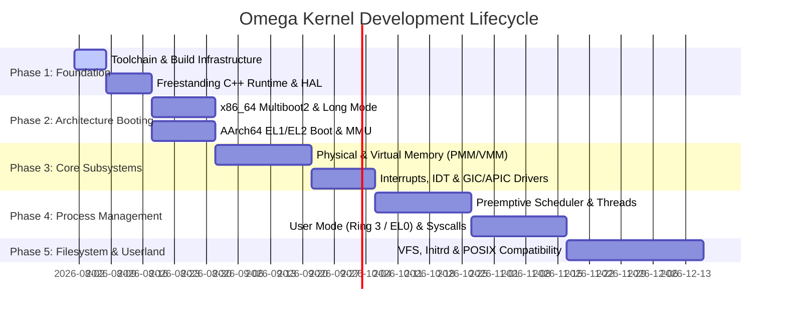

# Omega Kernel: Implementation Plan & Multi-Phase Roadmap

## Executive Summary
This document defines a detailed, step-by-step implementation plan and developmental roadmap for **Omega**—a cross-platform, freestanding microkernel written in C++20. Designed to cross-compile natively on macOS (Apple Silicon M1/M2/M3) using Clang and LLVM (`lld`), Omega targets both **x86_64** (x64) and **AArch64** (ARM64) architectures.

---

## 1. Development Phases Overview

---

## 2. Phase 1: Build Infrastructure & Freestanding Runtime

### 1.1 Toolchain Setup & CMake Toolchain Files
- **Goal**: Configure CMake cross-compilation files targeting `x86_64-unknown-none-elf` and `aarch64-unknown-none-elf` using Clang and `ld.lld`.
- **Key Tasks**:
  - Create `cmake/x86_64-toolchain.cmake` and `cmake/aarch64-toolchain.cmake`.
  - Enforce freestanding compilation flags across all target binaries:
    `-ffreestanding -fno-exceptions -fno-rtti -fno-threadsafe-statics -nostdlib -nostdinc`.
  - Validate linking with custom linker scripts (`kernel/arch/x86_64/linker.ld` and `kernel/arch/aarch64/linker.ld`).

### 1.2 Freestanding Standard Library (`kernel/sys/`)
- **Goal**: Provide standard C memory routines implicitly emitted by Clang optimization passes.
- **Components**:
  - `memcpy`, `memset`, `memmove`, `memcmp` in `kernel/sys/memory.cpp`.
  - Basic fixed-width integer typedefs (`uint8_t`, `uint32_t`, `uint64_t`, `size_t`, `uintptr_t`) in `kernel/include/std/cstdint.hpp`.
  - Early string formatting and UART logging utility (`kprintf`) in `kernel/sys/kprint.cpp`.

---

## 3. Phase 2: Architecture-Specific Bootstrapping

### 2.1 x86_64 Boot Sequence (`kernel/arch/x86_64/`)
- **Goal**: Transition CPU from 32-bit Multiboot2 state to 64-bit Long Mode and jump to `kernel_main`.
- **Implementation Steps**:
  1. **Multiboot2 Header (`boot.s`)**: Define magic `0x36d37189`, architecture `0` (i386), length, and checksum tags.
  2. **Page Table Initialization**: Construct static 4-level page tables (PML4, PDPT, PD, PT) identity-mapping the first 2 MB of physical memory with Huge Pages (2MB).
  3. **Control Register Configuration**: Enable PAE in `CR4`, set Long Mode bit (`LME`) in `EFER` MSR, and load `CR3` with PML4 address.
  4. **GDT Setup (`gdt.cpp`)**: Load 64-bit Global Descriptor Table with Code (selector `0x08`) and Data (selector `0x10`) segments.
  5. **Far Jump & Stack Handover**: Execute `ljmp` to 64-bit code segment, re-initialize `rsp`, and invoke `kernel_main()`.

### 2.2 AArch64 Boot Sequence (`kernel/arch/aarch64/`)
- **Goal**: Initialize Exception Levels, set up early translation tables, and transition to C++ kernel entry.
- **Implementation Steps**:
  1. **Exception Level Detection (`boot.s`)**: Query `CurrentEL`. If EL2 (hypervisor), configure `HCR_EL2.RW = 1` (64-bit execution) and execute `ERET` to drop to EL1.
  2. **Vector Table Setup (`vectors.s`)**: Define 16-entry exception vector table aligned to 2048 bytes; set `VBAR_EL1`.
  3. **MMU & Caches (`mmu.cpp`)**:
     - Configure memory attribute indirection register (`MAIR_EL1`) for Normal and Device memory.
     - Set up Translation Control Register (`TCR_EL1`) for 48-bit virtual address space.
     - Populate page tables for identity mapping and set `TTBR0_EL1` / `TTBR1_EL1`.
     - Enable MMU by setting `SCTLR_EL1.M = 1` and `SCTLR_EL1.C = 1` (data cache).
  4. **Stack & Handover**: Set `SP_EL1` stack pointer and jump to `kernel_main()`.

---

## 4. Phase 3: Memory Management & Interrupt Systems

### 3.1 Physical Memory Manager (PMM)
- **Mechanism**: Bitmap / Frame Allocator.
- **Tasks**:
  - Parse memory map passed by Multiboot2 (x86_64) or Flattened Device Tree / ACPI (AArch64).
  - Track 4KiB physical memory frames.
  - Implement `pmm_alloc_frame()` and `pmm_free_frame()`.

### 3.2 Virtual Memory Manager (VMM)
- **Mechanism**: Dynamic 4-Level Page Table Manipulation (PML4 for x86_64, Translation Tables for AArch64).
- **Tasks**:
  - Implement page allocation (`vmm_map_page`, `vmm_unmap_page`).
  - Kernel Higher-Half Mapping (map kernel code to `0xFFFF800000000000` / `0xFFFF000000000000`).
  - Heap Allocator (`kmalloc` / `kfree`) using a SLAB/SLUB allocator for kernel objects.

### 3.3 Interrupt & Timer Drivers
- **x86_64**:
  - Program IOAPIC / Local APIC and IDT (Interrupt Descriptor Table).
  - Program PIT / LAPIC Timer for quantum ticks.
- **AArch64**:
  - Program GICv2 / GICv3 (Generic Interrupt Controller).
  - Configure ARM Generic Timer (`CNTP_TVAL_EL0` / `CNTP_CTL_EL0`).

---

## 5. Phase 4: Threading, Scheduling & System Calls

### 4.1 Process & Thread Control Blocks
- Define `Thread` structure containing register state (`CpuContext`), stack pointer, process ID, priority, and thread state (`READY`, `RUNNING`, `BLOCKED`).

### 4.2 Preemptive Round-Robin Scheduler
- Context switching assembly routine (`cpu_switch_context`):
  - Save current thread registers to stack.
  - Switch stack pointer (`RSP` / `SP`).
  - Restore next thread registers and return.
- Timer interrupt callback triggers quantum expiration and scheduler evaluation.

### 4.3 System Call Architecture
- **x86_64**: `SYSCALL` / `SYSRET` instructions using MSRs (`IA32_STAR`, `IA32_LSTAR`).
- **AArch64**: `SVC` instruction handling via `sync_exception_el0` vector.
- Core Syscall ABI: `sys_read`, `sys_write`, `sys_fork`, `sys_exec`, `sys_exit`.

---

## 6. Verification & Automated Testing Matrix

| Component | Target Arch | Test Environment | Verification Metric |
| :--- | :--- | :--- | :--- |
| Build Toolchain | x86_64 & AArch64 | macOS M1 Host | Clean compile with Zero Warnings under `-Wall -Wextra` |
| Early Console | x86_64 | QEMU (`qemu-system-x86_64`) | Serial COM1 output: `"Omega Kernel Booting (x86_64)..."` |
| Early Console | AArch64 | QEMU (`qemu-system-aarch64 -M virt`) | PL011 UART output: `"Omega Kernel Booting (AArch64)..."` |
| PMM Frame Allocator | Dual | QEMU Emulation | Stress test allocating and freeing 100,000 frames |
| Preemptive Scheduler| Dual | QEMU Multi-core (`-smp 2`) | Concurrent execution of 4 threads printing alternating logs |
