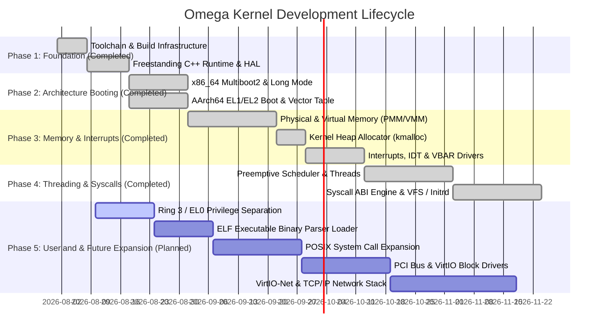

# Omega Kernel: Implementation Plan & Multi-Phase Roadmap

## Executive Summary
This document defines a detailed, step-by-step implementation plan and developmental roadmap for **Omega**—a cross-platform, freestanding microkernel written in C++20. Designed to cross-compile natively on macOS (Apple Silicon M1/M2/M3) using Clang and LLVM (`lld`), Omega targets both **x86_64** (x64) and **AArch64** (ARM64) architectures.

---

## 1. Development Lifecycle Status

---

## 2. Phase 1 to Phase 4: Core Subsystems (Completed)

### 1.1 Toolchain & Freestanding Runtime (Completed)
- **Status**: Completed.
- CMake toolchain integration (`x86_64-toolchain.cmake` and `aarch64-toolchain.cmake`) using LLVM `clang++` and `ld.lld`.
- Freestanding memory routines (`memcpy`, `memset`, `memmove`, `memcmp`), vararg serial printing (`kprintf`), COM1 UART (x86_64), and PL011 UART (AArch64).

### 1.2 Architectural Bootstrapping (Completed)
- **Status**: Completed.
- **x86_64**: 32-to-64 bit Long Mode transition (`_start`), PML4 identity page tables (first 1GB mapped using 2MB Huge Pages), GDT loading, and Xen PVH ELF note (`.xen_note` + `PT_NOTE`).
- **AArch64**: Exception Level drop (`EL2 -> EL1`), 2048-byte aligned `VBAR_EL1` 16-entry exception vector table, and `CPACR_EL1` FP/SIMD enablement.

### 1.3 Memory & Interrupt Subsystems (Completed)
- **Status**: Completed.
- **PMM**: 4KiB Bitmap Frame Allocator tracking physical frames (`alloc_frame` / `free_frame`).
- **VMM**: 4-Level Page Table Mapping Engine interacting with architectural base registers (`CR3` and `TTBR0_EL1`).
- **Heap Allocator**: Free-list `BlockHeader` allocator (`kmalloc` / `kfree`) with 8-byte alignment and block coalescing.
- **Interrupts**: x86_64 256-entry Ring 0 IDT gate (`lidt`) and AArch64 System Vector Base (`VBAR_EL1`).

### 1.4 Scheduler, Syscalls & VFS (Completed)
- **Status**: Completed.
- Preemptive Round-Robin Thread Control Block scheduler executing cooperative yields.
- System Call ABI Dispatcher (`sys_call`) supporting `SYS_WRITE`, `SYS_YIELD`, `SYS_EXIT`.
- Virtual Filesystem (`VfsNode` tree with `/` mounted) and RAM Disk (`Initrd`) file driver.

---

## 3. Phase 5: Future Expansion Roadmap (Planned)

### 5.1 Userland Mode & Privilege Separation (Ring 3 / EL0)
- **Goal**: Establish userland privilege boundaries for isolated process execution.
- **Implementation Tasks**:
  - **x86_64**: Construct Task State Segment (TSS) for Ring 0 stack switching on interrupts; configure `SYSCALL`/`SYSRET` MSRs (`IA32_STAR`, `IA32_LSTAR`, `IA32_FMASK`).
  - **AArch64**: Set up EL0 user stack pointers (`SP_EL0`); handle `SVC` trap instructions via `sync_exception_el0` vector table.

### 5.2 ELF Executable Binary Parser & Loader (`elf_loader`)
- **Goal**: Execute dynamically loaded userland binaries from VFS/Initrd.
- **Implementation Tasks**:
  - Parse 64-bit ELF headers (`Elf64_Ehdr`) and Program Headers (`Elf64_Phdr`).
  - Allocate physical frames via PMM and map `PT_LOAD` segments into isolated userland virtual address spaces via VMM.

### 5.3 POSIX System Call Surface Expansion
- **Goal**: Provide full POSIX compliance for standard C userland runtime support.
- **Implementation Tasks**:
  - Process File Descriptor Tables (`fd` table mapping to `VfsNode`).
  - Implement syscalls: `sys_open`, `sys_read`, `sys_close`, `sys_fork`, `sys_execve`, `sys_waitpid`, `sys_brk`.

### 5.4 PCI Bus & Block Device Drivers
- **Goal**: Provide disk storage persistence beyond memory initrd.
- **Implementation Tasks**:
  - **x86_64**: Scan PCI configuration space (`0xCF8`/`0xCFC` I/O ports); implement IDE/AHCI and VirtIO-Block disk controller drivers.
  - **AArch64**: Parse Flattened Device Trees (FDT / `.dtb`) provided by QEMU to dynamically discover memory and VirtIO devices.

### 5.5 Networking Stack (L2 - L4)
- **Goal**: Enable network connectivity.
- **Implementation Tasks**:
  - Implement VirtIO-Net network card driver.
  - Construct lightweight TCP/IP network stack (Ethernet, ARP, IPv4, UDP, TCP socket layer).

---

## 4. Verification & Automated Testing Matrix

| Subsystem | Target Arch | Test Environment | Verification Metric |
| :--- | :--- | :--- | :--- |
| Build Toolchain | x86_64 & AArch64 | macOS M1 Host | Clean compile with Zero Warnings under `-Wall -Wextra` |
| Early Console | x86_64 | QEMU (`qemu-system-x86_64`) | Serial COM1 output: `"Omega Kernel Booting (x86_64)..."` |
| Early Console | AArch64 | QEMU (`qemu-system-aarch64 -M virt`) | PL011 UART output: `"Omega Kernel Booting (AArch64)..."` |
| PMM Frame Allocator | Dual | QEMU Emulation | Stress test allocating and freeing 100,000 frames |
| Preemptive Scheduler| Dual | QEMU Multi-core (`-smp 2`) | Concurrent execution of 4 threads printing alternating logs |
| Privilege Switching| Dual | QEMU Emulation | Successful Ring 3 / EL0 jump and sysenter trap execution |
